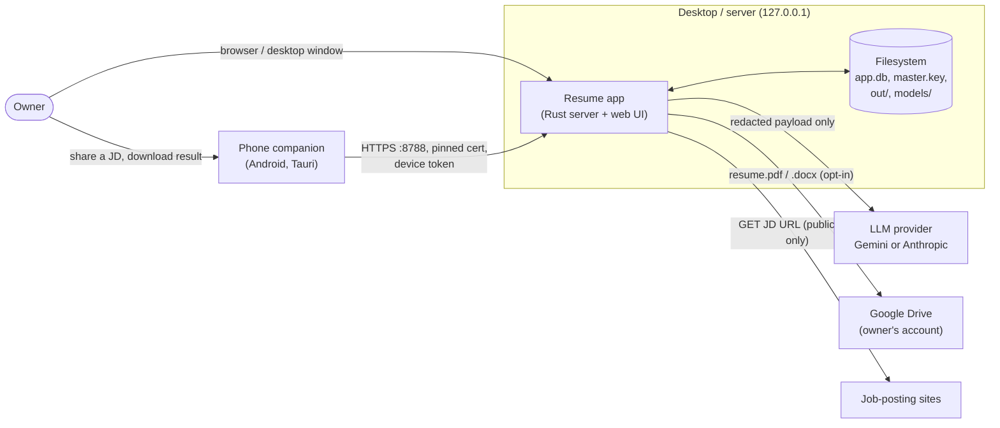
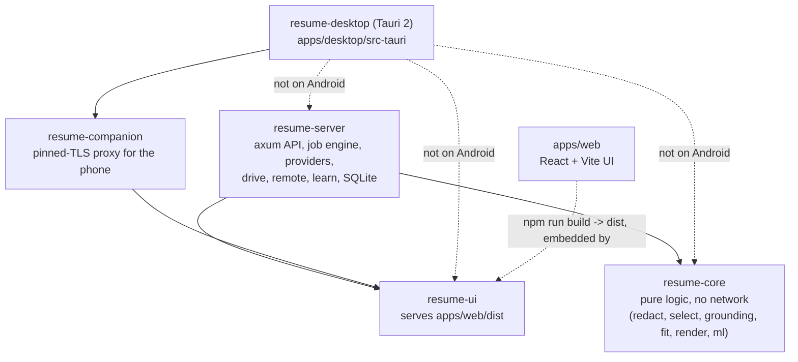
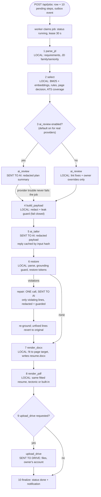
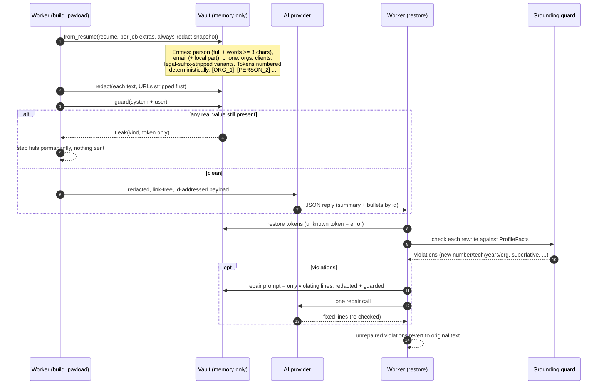
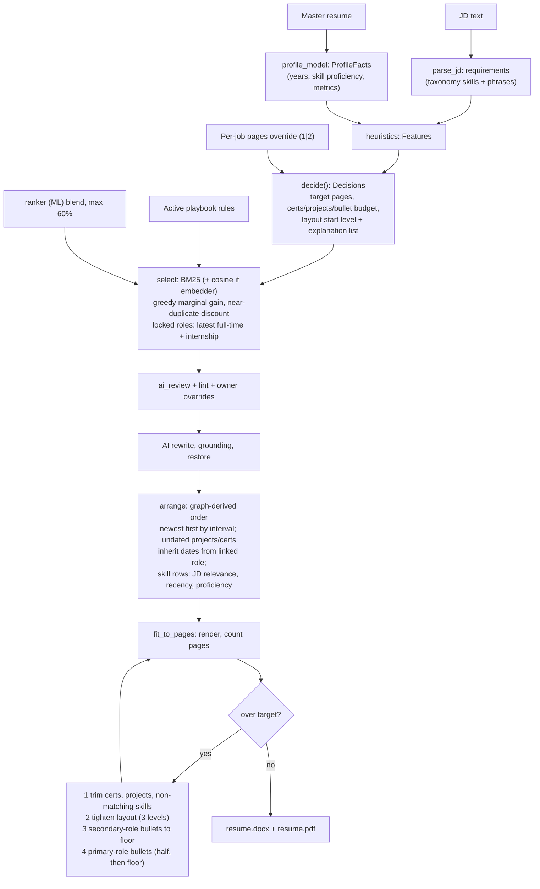
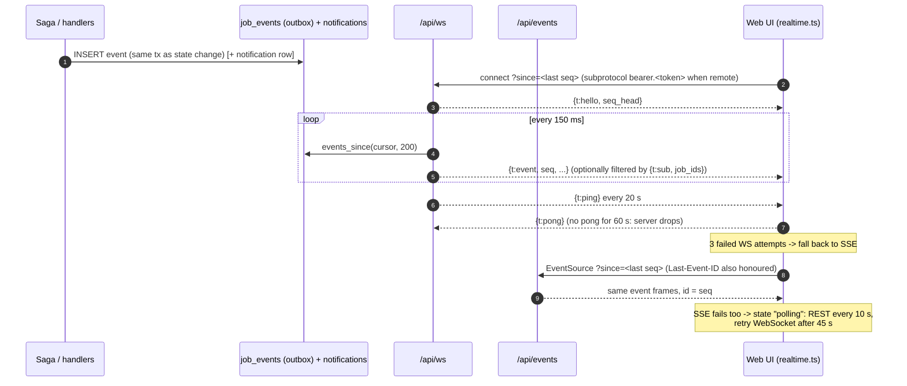
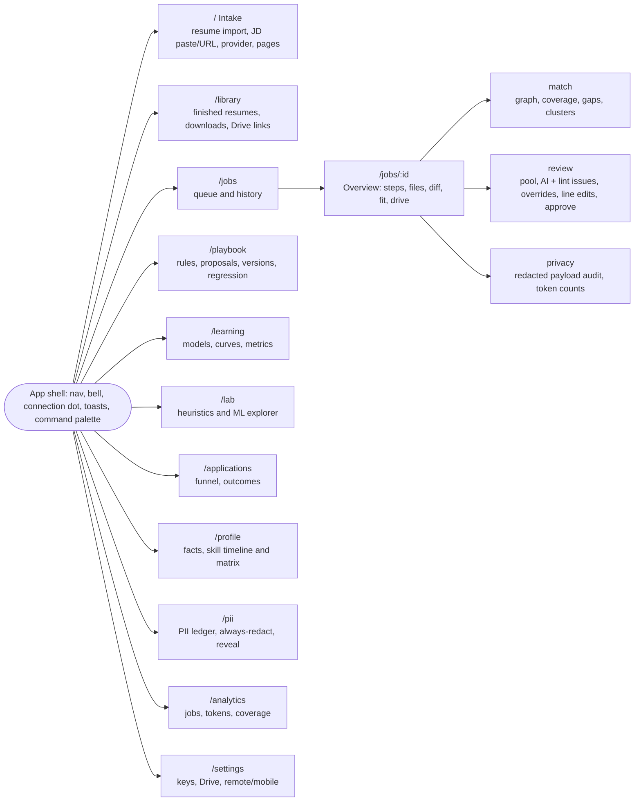

# Architecture

How the pieces fit. See also: [README](../README.md), [privacy and security](privacy-and-security.md), [learning system](learning-system.md).

Contents: [1 Context](#1-system-context) / [2 Crates](#2-crates-and-dependencies) / [3 Job saga](#3-job-saga) / [4 Redaction](#4-pii-redaction-guard-and-restore) / [5 Selection](#5-selection-arrangement-and-fit) / [6 Realtime](#6-realtime) / [7 Companion](#7-mobile-companion-pairing-and-proxy) / [8 Data model](#8-sqlite-data-model) / [9 Web app](#9-web-app-page-map) / [Decisions](#design-decisions-and-trade-offs)

## 1. System context



- Everything except the three outbound arrows runs locally. Only the *redacted* payload goes to the LLM; Drive upload is off unless the job asks for it.
- The UI is always served by a loopback origin: the server itself (browser/desktop) or the companion proxy (phone).
- The phone never talks to the LLM or Drive; it only calls an allow-listed subset of the desktop API.

Key files: `crates/server/src/main.rs`, `crates/server/src/remote.rs`, `apps/desktop/src-tauri/src/lib.rs`.

## 2. Crates and dependencies



- `resume-core` has no HTTP, DB or async. Everything in it is deterministic and unit-tested (the optional `embeddings` feature adds the ONNX model via `fastembed`).
- `resume-server` owns state: the SQLite connection (one `Mutex<Connection>`; async code goes through `App::db`, which uses `spawn_blocking`), the saga, providers, Drive, remote listener, realtime, learning.
- `resume-ui` embeds `apps/web/dist` with `rust-embed` (feature `embed-ui`) or reads `$RESUME_UI_DIR`; adds a CSP and SPA fallback.
- `resume-companion` is a small proxy (127.0.0.1, random port): serves the UI and forwards `/api/*` to the paired desktop.
- `resume-desktop`: on desktop it opens the full server in-process; on Android (or with feature `companion`) it starts only the companion. A `--serve-only` flag runs it headless.
- `resume-server` as a dev-dependency of `resume-companion` is for the proxy integration test.

Key files: `Cargo.toml` (workspace), `crates/*/Cargo.toml`, `crates/ui/src/lib.rs`, `apps/desktop/src-tauri/src/lib.rs`.

## 3. Job saga

Ten steps, in this order (`STEPS` in `crates/server/src/lib.rs`). "Sent to AI" means data leaves the machine, always redacted.



Failure, retry and recovery:

- **Lease.** `claim` flips one `queued` job to `running` with `lease_until = now + 30 s`. A heartbeat task renews it every 10 s. The sweeper (every 5 s, and once at startup for all running jobs) requeues expired leases with a "resuming from first unfinished step" event.
- **Resume.** Each step has an `input_hash` chained from the previous step's. If a step is `done` with the same hash its stored output is reused, so only unfinished work runs. The worker re-checks `status='running' AND lease_owner=me` before every step (cancel takes effect at the next step boundary).
- **Retry.** `StepErr::Transient` (network, 5xx, 429, timeout) retries up to 4 attempts with exponential backoff (500 ms x 2^n plus jitter). `Permanent` fails the job at once, `dead` after exhausted retries. `POST /api/jobs/:id/retry?from=<step>` resets that step and later ones. Retrying at or before `ai_tailor` also drops its cached reply.
- **No double payment.** The AI reply is inserted into `ai_cache` immediately after the provider returns, in its own transaction, keyed by `sha256(system, user, provider)`. A crash before the step commit re-uses it.
- **Outbox.** Step state change and its `job_events` row commit in the same transaction. Realtime delivery tails that table (section 6), so nothing is lost on crash.
- **Files.** Render output goes to `.tmp-<uuid>`, is fsynced and renamed into `data/out/<job>/`; stale temp dirs are cleaned on the next run. DOCX and PDF share one fitted resume.
- **Errors.** Failures are classified (`errors.rs`: `ai.rate_limited`, `ai.auth`, `ai.model_unavailable`, `redact.leak`, `drive.not_connected`, ...) into a title, hint, retryable flag and action buttons. The raw message is dropped for `redact.leak` since it could name values.
- **Event privacy flag.** Each event has `local_only`: true for local steps, false for the lines that describe data sent to AI or Drive ("Sending 3.1k tokens, redacted, to gemini").
- **Fault injection.** `Fault::After(n)` / `Fault::Mid(n)` simulate crashes in tests (`crates/server/tests/it.rs`).

Key files: `crates/server/src/lib.rs` (saga), `crates/server/src/review.rs` (`ai_review`), `crates/server/src/errors.rs`, `crates/server/src/drive.rs`.

## 4. PII redaction, guard and restore



- The vault is rebuilt from the resume each run and never serialised; `Debug` prints only a count. Token numbering is sorted by (kind, normalised value), so the same inputs give the same tokens, and the always-redact list is snapshotted (encrypted) per job so numbering never drifts between retries.
- `redact` already-present tokens are protected and it is idempotent; `guard` uses normalised substring matching for values of 6+ characters and word-boundary matching for shorter fragments (see [privacy doc](privacy-and-security.md#the-guard)).
- Besides the main payload, the review prompt, repair prompt and playbook rule text (appended to the writer prompt) all pass through the same vault and guard.
- Grounding checks a rewrite against facts derived from the resume (`profile_model`): numbers, technologies, years claims, employers/clients, superlatives, copying from source, summary line shape and word count.

Key files: `crates/core/src/redact.rs`, `payload.rs`, `grounding.rs`, `profile_model.rs`, `crates/server/src/pii.rs`.

## 5. Selection, arrangement and fit



- **Heuristics** (`heuristics.rs`) add weighted signals (years of experience, JD seniority and years asked, number and required fraction of requirements, relevant content volume, roles, JD length, junior/senior keywords, the page count of your previous resume) to a bias; at or above `page_threshold` the target is 2 pages. Each decision records an outcome string the UI shows ("why"). All numbers are in `Heuristics` and can be overridden via `heuristics.json` (`GET/PUT/DELETE /api/heuristics`, validated ranges).
- **Selection** locks the latest full-time and latest internship role; one older role is added only if it raises weighted coverage by a threshold. Certs rank by relevance, featured flag, recency, issuer prestige; projects by semantic similarity, marginal JD weight, tier prior, recency.
- **Graph** (`graph.rs`) is a typed graph of roles, orgs, clients, projects, skills, bullets, certs and JD requirements with `During` edges that give undated items an inferred interval. `arrange.rs` uses the same intervals so order is explainable (`arrangement.reasons` in the job detail).
- **Fit** (`fit.rs`) never drops below floors for the primary role and stops after `fit_max_renders` renders (default 8). The learned fit model (`ml/fit_model.rs`) can pick the starting layout level to save renders when its confidence is at least 0.6. If it still does not fit, a warning is raised and the result is kept.
- **Emphasis**: `**bold**` markup is added deterministically to JD-matched skills and metrics at render time when `emphasis` is on.

Key files: `crates/core/src/{heuristics,select,graph,arrange,fit,latex,native_pdf,docx,emphasis}.rs`.

## 6. Realtime



- Replay and live are the same query on a monotonic `seq`, so there are no gaps or duplicates; the client keeps the last delivered seq in `sessionStorage` and de-duplicates by seq.
- `job_id` is nullable: system events (model ready, Drive, remote paired) use `scope: system`. Events with `notify` also get a row in `notifications` (read/unread), listed at `GET /api/notifications` and marked at `POST /api/notifications/read`. Terminal job events carry an "Open job" action.
- A WebSocket client that cannot take a frame within 5 s is dropped. WebSocket upgrades check `Origin` (localhost or Tauri origins) unless the remote token gate already authenticated them. Revoking a device cancels its live streams.
- Per-job `GET /api/jobs/:id/events` is an older SSE endpoint that ends when the job leaves queued/running.
- The phone companion proxy does not forward WebSockets, so the UI starts on SSE in companion mode.
- Known limit: the 150 ms cursor poll is simple rather than push-based (`ponytail` comment in `realtime.rs`).

Key files: `crates/server/src/realtime.rs`, `apps/web/src/realtime.ts`, `apps/web/src/lib/useJob.ts`.

## 7. Mobile companion pairing and proxy

```mermaid
sequenceDiagram
    autonumber
    participant O as Owner
    participant D as Desktop UI (localhost)
    participant R as Remote listener :8788 (TLS)
    participant C as Companion proxy (phone, 127.0.0.1:random)
    participant W as Phone WebView

    O->>D: Settings > Mobile: turn on
    D->>R: start (self-signed cert generated once, key mode 0600)
    O->>D: New pairing code
    D-->>O: QR {hosts, port, fp = SHA-256 of cert, code}; code valid 5 min, single use
    Note over C,W: App start: proxy binds 127.0.0.1:0, writes port + launch secret (0600),<br/>WebView opens /?k=<secret>
    W->>C: GET /?k=secret
    C-->>W: 302 + cookie ck=hash(secret), HttpOnly, SameSite=Strict
    O->>W: scan QR
    W->>C: POST /companion/pair {payload, device_name}
    C->>R: POST /pair {code, device_name} (TLS trusts ONLY cert with pinned fp)
    R-->>C: {device_id, token} (token stored as sha256 on desktop)
    C->>C: save companion.json (0600): hosts, port, fp, token
    loop every API call
        W->>C: /api/... (cookie required)
        C->>R: same path + Authorization: Bearer token
        R->>R: hash token, lookup, not revoked, rate limit, allow-list, audit
        R-->>C: response (SSE streams end on revoke)
        C-->>W: response
    end
```

- **Launch secret.** Every companion request needs the per-launch secret (query once, then cookie, or the `x-companion-key` header used by the native share handler), plus a loopback `Host` and `Origin`. This stops other apps and web pages on the phone from using the stored token.
- **Pinning.** The proxy uses a custom rustls verifier that accepts exactly one certificate (by SHA-256) and does no CA or hostname validation. A mismatch surfaces as `net.pinning_failed`. It tries each advertised host (LAN IPs, Tailscale, hostname) and remembers the one that answered.
- **Desktop gate.** On the remote listener, only `/pair`, the UI static files and an explicit allow-list of API routes (jobs, events/ws, corrections, playbook approve/reject, applications, notifications, library, `jd/fetch`, learning metrics) are reachable, only with a valid bearer token. Everything else is 403. `/api/remote/*` (admin) does not exist there and on localhost answers only to a localhost `Host` header. Pairing is limited to 5 attempts per minute per IP, then a 10 minute lockout; each device is limited to 300 requests/minute; every request is audited by method, path template and status (`device_audit`).
- The phone UI hides pages the desktop would deny (`CO_HIDDEN` in `apps/web/src/companion.tsx`).
- The desktop listener binds `0.0.0.0:$REMOTE_PORT` (default 8788). Android permits cleartext only to 127.0.0.1 (`network_security_config.xml`).

Key files: `crates/server/src/remote.rs`, `crates/companion/src/lib.rs`, `apps/web/src/companion.tsx`, `apps/web/src/components/MobileCard.tsx`.

## 8. SQLite data model

Tables are created at startup (`CREATE TABLE IF NOT EXISTS`, plus additive `ALTER TABLE` migrations). WAL mode, `synchronous=FULL`. Only `job_steps.job_id` is a declared foreign key; the other links are logical. The ML bundle (all models as one JSON blob) lives in `settings` under `ml_bundle`.

```mermaid
erDiagram
    resume {
        int id PK "always 1"
        text json
    }
    jobs {
        text id PK
        text status "queued running done failed dead cancelled"
        text provider
        text jd_text
        text extra_redact_json
        int max_tokens
        text lease_owner
        int lease_until
        text error
        text company
        text role
        int upload_drive
        int pages
        blob always_enc "encrypted always-redact snapshot"
        int ai_review
        text user_overrides
    }
    job_steps {
        text job_id PK,FK
        text name PK
        text status
        int attempts
        text input_hash
        text output_json
        text error
    }
    job_events {
        int seq PK "outbox cursor"
        text job_id "null = system scope"
        text step
        text level
        text message
        int local_only
        text kind
        text code
    }
    notifications {
        int seq PK "= job_events.seq"
        int read
    }
    ai_cache {
        text key PK "= ai_tailor input_hash"
        text reply_redacted
        text provider
        int tokens_in
        int tokens_out
    }
    keys {
        text provider PK "anthropic gemini google_oauth google_refresh"
        blob blob "AES-GCM"
    }
    settings {
        text key PK
        text value
    }
    pii_always {
        text id PK
        text kind
        blob value_encrypted
    }
    job_prefs {
        text job_id PK
        text jd_vec_kind
        text overrides_json
    }
    job_ml {
        text job_id PK
        text vec_json
        text vec_kind
        text label_json
    }
    jd_corpus {
        text job_id PK
        text terms_json
    }
    ml_feedback {
        int id PK
        text job_id
        text bullet_id
        text action
        text features_json
    }
    applications {
        text job_id PK
        text stage
        text features_json
    }
    application_history {
        int id PK
        text job_id
        text stage
        text note
    }
    corrections {
        int id PK
        text job_id
        text area "certs projects roles skills summary bullets"
        text action "add remove keep reorder edit"
        text item_json
        text reason_tags
        text jd_family
        real weight
    }
    playbook_rules {
        text id PK
        text status
        text scope
        text area
        text matcher_json
        text action_json
        text origin
        int version
    }
    playbook_versions {
        int version PK
        text note
        text snapshot
    }
    job_edits {
        text job_id PK
        text path PK
        text text
    }
    golden {
        int id PK
        text job_id UK
        text final_selection_json
    }
    regression_runs {
        int id PK
        text result_json
    }
    remote_devices {
        text id PK
        text name
        text token_hash UK
        int revoked
        int last_seen
    }
    device_audit {
        int ts
        text device_id
        text method
        text path_template
        int status
    }

    jobs ||--o{ job_steps : has
    jobs ||--o{ job_events : emits
    job_events ||--o| notifications : "may notify"
    job_steps ||--o| ai_cache : "ai_tailor hash"
    jobs ||--o| job_prefs : has
    jobs ||--o| job_ml : has
    jobs ||--o| jd_corpus : has
    jobs ||--o{ ml_feedback : trains
    jobs ||--o| applications : tracked
    applications ||--o{ application_history : history
    jobs ||--o{ corrections : yields
    jobs ||--o{ job_edits : "persistent edits"
    jobs ||--o| golden : approved
    playbook_rules ||--o{ playbook_versions : "snapshotted in"
    remote_devices ||--o{ device_audit : audited
```



Where each table is defined: `crates/server/src/lib.rs` (core tables), `realtime.rs` (`notifications`, `job_events` rebuild), `mlsvc.rs`, `review.rs` (`job_prefs`), `learn.rs`, `remote.rs`.

## 9. Web app page map



- State and data access: `apps/web/src/api.ts` (all REST calls; a demo mode with in-browser fixtures kicks in when `/api/health` is not JSON), `store.tsx`, `lib/useJob.ts`, `realtime.ts`.
- `companion.tsx` shows the pairing screen when the page is served by the phone proxy and hides Lab, Profile, PII, Analytics and Settings.
- Pages are lazy-loaded (`App.tsx`). In dev, Vite on :5173 proxies `/api` to 127.0.0.1:8787 (the server allows CORS only from those dev origins).

## Design decisions and trade-offs

- **Why Rust.** One static binary for server, desktop and Android; memory safety for a program that holds secrets; the same core crate runs everywhere; `rusqlite` bundled SQLite, `rustls` for pinned TLS, ONNX for local embeddings. Cost: slower iteration and heavier toolchain (see README developer setup).
- **Why a SQLite saga instead of Redis or a queue.** A single-user local app needs durability and resume, not distribution. The jobs table is the queue, leases give at-least-once with takeover, step rows make steps idempotent, and `job_events` is both audit log and outbox. No extra process to install or secure. Limit: one machine, and one global connection mutex, so throughput is modest (two workers).
- **Why WebSocket plus SSE plus polling.** WebSocket gives low latency and heartbeats on desktop; SSE passes through simple proxies and the phone proxy; polling is the last resort. All three read the same seq-cursor outbox, so switching transports is lossless.
- **Why rules need approval.** Learned rules change what ends up on a resume. Mined rules are only ever *proposed* (>= 3 consistent jobs), shown with examples and a replayed impact on approved resumes, and activate only when you approve. Rules can re-rank, drop or require items the selection already validates; they cannot touch the PII guard, grounding, caps or locked roles. Every change is versioned and reversible ([learning system](learning-system.md)).
- **Why no fine-tuning.** Your history is tens of examples, not thousands; fine-tuning would need sending private data off-machine or heavy local training, and is hard to inspect or undo. Small models with priors (logistic regression, naive Bayes, ridge) blend with hand-tuned scores, report honest cross-validated cards, and stay cold-start safe.
- **Why redact-then-guard instead of trusting redaction.** Redaction can miss variants, so a second, stricter pass (`guard`) rejects the whole request on any residue. Failing closed costs an occasional blocked job; leaking costs more.
- **Why deterministic selection, AI only for wording.** Which content appears (and in what order and length) is local, explainable and testable; the LLM only rewords text it is given and cannot add facts (grounding).
- **Known limits.**
  - Redaction covers person, email, phone, orgs, clients and your always-redact entries. Schools, locations, project and cert names, and free-text mentions of third parties are sent unless added (see [residual risks](privacy-and-security.md#residual-risks)).
  - Linux-first: the key vault uses Unix file modes; Windows/macOS are not supported as-is.
  - The generated-files folder for the server binary is `data/out` relative to the working directory.
  - The desktop shell does not call `remote::autostart`, so the phone listener is started by toggling it in Settings after launch (the server binary autostarts it when it was left on).
  - On the desktop app the HTTP port is random unless `PORT` is set, which matters for the Google OAuth redirect URI.
  - Playbook mining covers certs and projects only; ranker training uses explicit keep/remove signals.
  - The JD parser is a taxonomy-driven keyword approach (`crates/core/data/skills.txt`), not an LLM, so unusual skills may be missed.
  - Import is heuristic; low-confidence imports produce warnings to review.
  - No multi-user or cloud sync model; Drive upload is write-only convenience.
